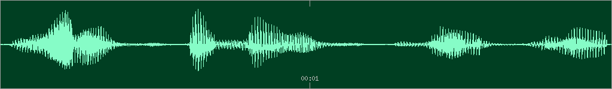
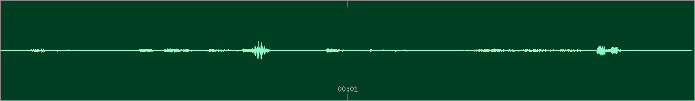
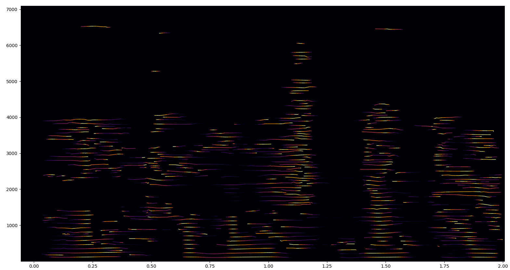
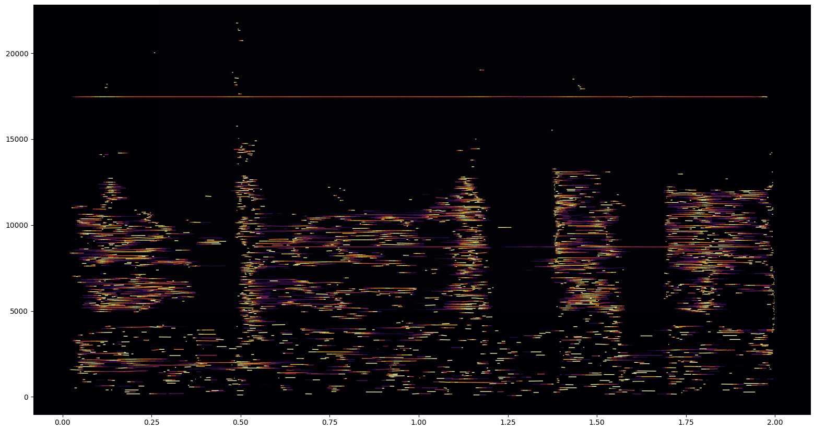
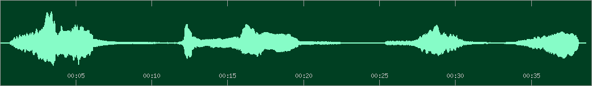

# loristrck

Welcome to the **loristrck** documentation!

**loristrck** is a wrapper for the C++ library [Loris](<https://sourceforge.net/projects/loris/files/Loris/>).

It is written in cython and targets python 3 (>= 3.8 at the moment). 

## Quick Introduction

```python

import loristrck as lt

# Read a soundfile as a numpy array
samples, sr = lt.sndreadmono("voice.wav")

# Analyze the soundfile with a frequency resolution of 30 Hz and 
# a window size of 40 Hz. A hoptime of 1/120 will result in 4x overlap
partials = lt.analyze(samples, sr, resolution=30, windowsize=40, 
                      hoptime=1/120)

# partials is a python list of numpy arrays
# select a subset of most significant partials
selected, noise = lt.select(partials, mindur=0.02, maxfreq=12000, 
                            minamp=-60, minbp=2)


# now resynthesize both parts separately 
lt.partials_render(selected, outfile="selected.wav")
lt.partials_render(noise, outfile="residual.wav")

# Save the analysis as a .sdif file with RBEP format
lt.write_sdif(partials, "analysis.sdif")
```

**selected.wav**



<audio controls="controls">
  <source type="audio/mp3" src="assets/sine.mp3"></source>
  <source type="audio/ogg" src="assets/sine.ogg"></source>
</audio>

**residual.wav**



<audio controls="controls">
  <source type="audio/mp3" src="assets/noise.mp3"></source>[I[O]]
  <source type="audio/ogg" src="assets/noise.ogg"></source>
</audio>

Partials can be plotted:

``` python

# plot selected partials
lt.plot_partials(selected)
lt.plot_partials(noise)

```




Partials are 2D numpy arrays of shape (num. rows, 5), where each row represents a breakpoint and each breakpoint
consists of five values: ``time, frequency, amplitude, phase, bandwidth``.
Since partials are numpy arrays, they can be easily modified in python. For example, it is possible to stretch the timing:

``` python

def stretch(partial, factor):
    partial2 = partial.copy()
    partial2[:,0] = partial[:,0]*factor
    return partial2
    
stretched_partials = [stretch(partial, 20) for partial in selected]
lt.partials_render(selected, outfile="stretched.wav")

```



<audio controls="controls">
  <source type="audio/mp3" src="assets/stretched.mp3"></source>
  <source type="audio/ogg" src="assets/stretched.ogg"></source>
</audio>


----

## Installation

### macOS

```bash
brew install fftw
pip install loristrck
```

----

### Linux

For debian/ubuntu, the dependencies can be installed via `apt`:

```bash
sudo apt install libfftw3-dev libsndfile1-dev
pip install loristrck
```

----

### Windows

```
pip install loristrck
```

